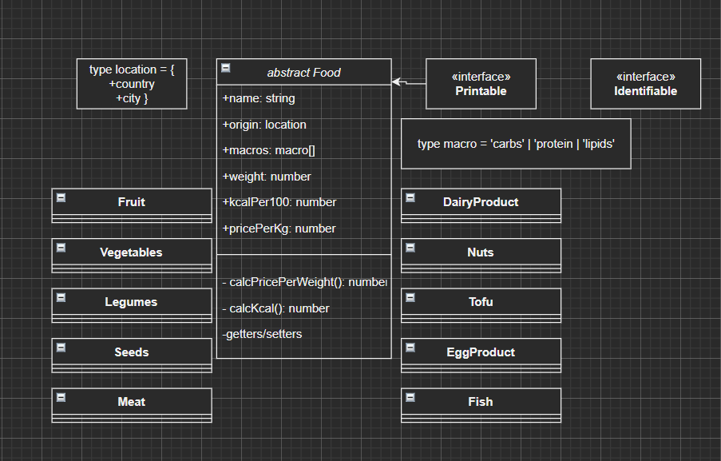
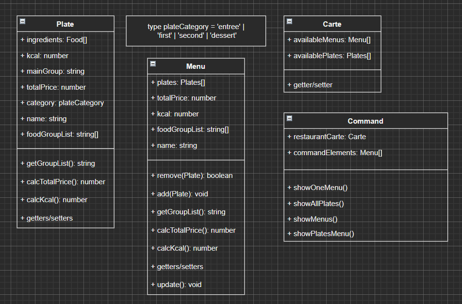
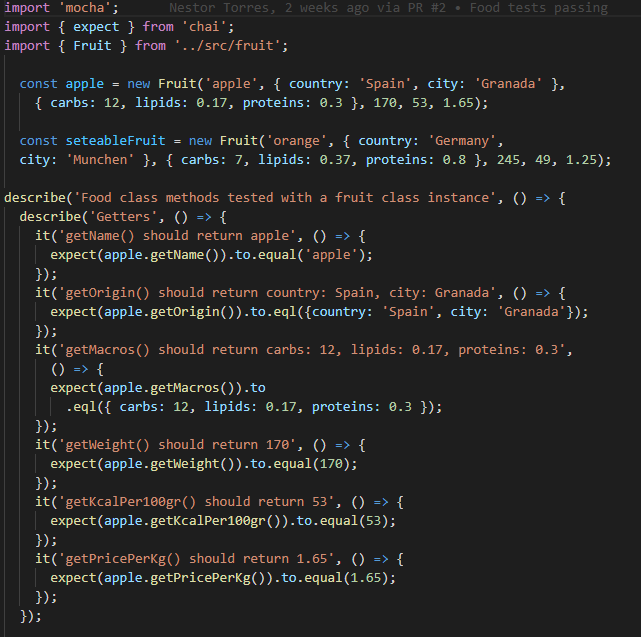
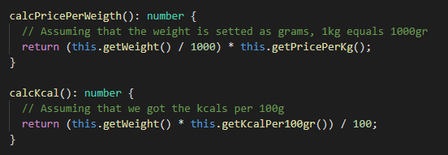
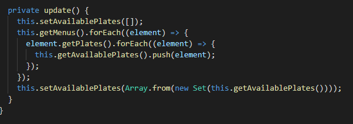

## Introducción

Tras lo aprendido en las semanas anteriores, nos enfrentaremos al primer gran reto de la asignatura: un diseño de una aplicación grupal. 

Los pasos a abordar son: primero una reunión para decidir el diseño de clases, para partir de una base similar de trabajo.

Después, se procederá a realizar una división de trabajo coherente con el diseño realizado, haciendo las modificaciones pertinentes a lo propuesto previamente.

Tras esto, de manera asíncrona, se dividirán las labores adicionales, tales como la redacción del informe, la configuración de las GitHub Actions, y la correcta documentación del código.

Por último, se realizará una prueba conjunta del funcionamiento correcto de la aplicación, apuntando posibles mejores que serán implementadas en caso de disponer de suficiente tiempo y en caso contrario, se comentarán como futuras mejoras en las conclusiones del presente informe.

## Objetivos

- Leer documentacion de Inquirer.js y Lowdb.
- Hacer uso de los pull requests de GitHub.
- Repasar los principios SOLID.
- Escribir pruebas para cada ejercicio.
- Resolver los ejercicios propuestos.
- Mantenerse dentro del ámbito de las soluciones propuestas (no utilizar elementos del lenguaje todavia no impartidos en clase).
- Elaborar un informe que explique lo realizado.
- Documentar los ejercicios.

## Diseño previo

Se optó por un diseño altamente modular y extendible mas allá de los requerimientos específicos de la práctica, intentando respetar los principios __SOLID__ lo más posible, en particular _Open-Closed_ e _Interface segregation_.

En la primera mitad del diagrama de clases, se observa la clase abstracta __Food__, de la que heredan todos los tipos de ingredientes/alimentos definidos. Detalles interesantes son los tipos __location__ y __macro__, definidos como tipos a utilizar para definir atributos de la clase.

También se pueden apreciar las interfaces _Printable_ y _Identifiable_, que definen la capacidad de ser impreso y de identificar el nombre de un tipo de ingrediente.

## Implementacion de clases base, testing

Para la implementación, se siguió la metodología TDD, diseñando los tests, prediciendo el comportamiento de las clases previo a su desarrollo. Un ejemplo de los tests diseñados sería:

La implementación del diseño de clases se realizó de manera separada, con Nestor desarrollando la primera mitad y Eduardo la segunda. Un ejemplo de algunas de las funcionalidades implementadas: 

_Métodos de ejemplo en la clase Food_

_Método de ejemplo en la clase Carte_
## Implementacion de Inquirer

## Implementacion de LowDB

## Github Actions

## Conclusiones

## Bibliografía

Inquirer.js (s.f.). En _NPM_. Recuperado el 10 de abril de 2021 de https://www.npmjs.com/package/inquirer

Lowdb (s.f.). En _NPM_. Recuperado el 10 de abril de 2021 de https://www.npmjs.com/package/lowdb

SOLID principles using TypeScript (s.f.). En _SamuelEresca.net_. Recuperado el 13 de marzo de 2021 de https://samueleresca.net/solid-principles-using-typescript/

